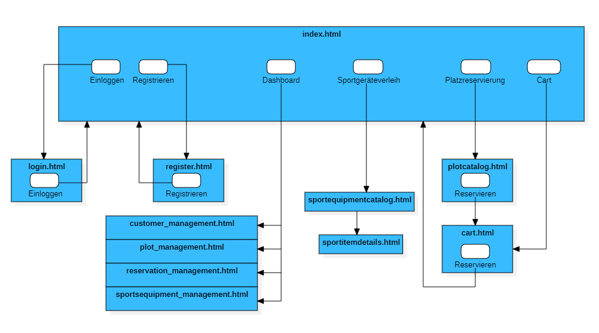
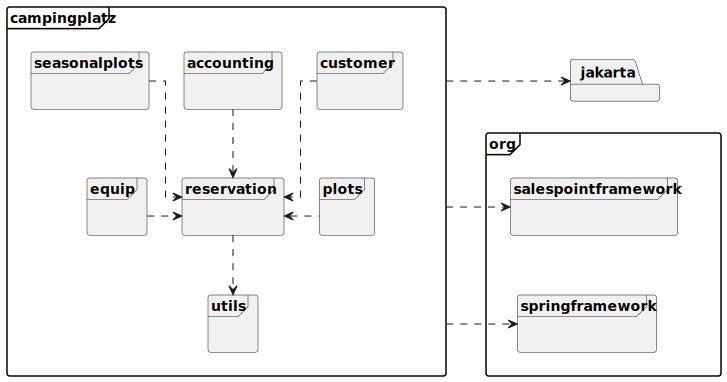
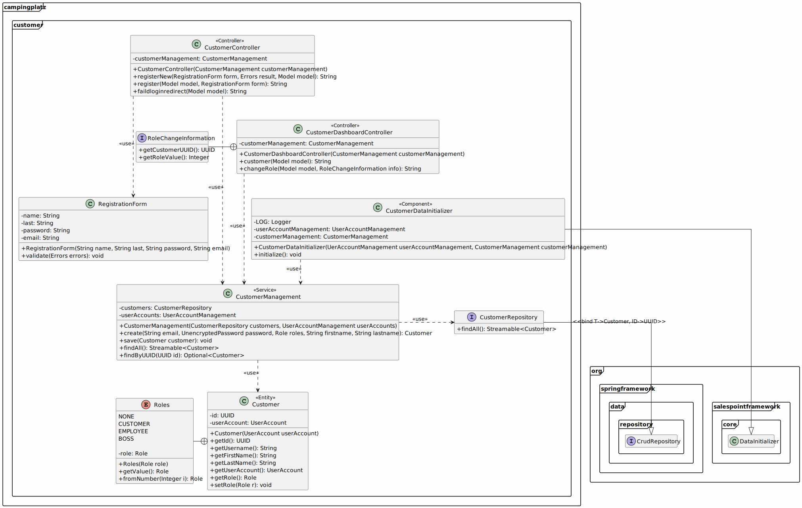

:toc: macro
:toc-title: 
:toclevels: 2
:numbered:
:project_name: Camping Platz
:company_name: Below-The-Sun
:doctype: book

[options="header"]
[cols="1, 3, 3"]
|===
|Version | Bearbeitungsdatum   | Autor 
|0.5	 | 11.11.2023          |
|1.0     | 13.11.2021          |  Arsenev, Daniel +
Ponizil, Vincent +
Stegner, Armin +
Müller, Jannes +
Voigtmann, Richard  +
Fiedler, Tom +
Drumeva, Irina
|1.1      | 10.12.2023   | Fiedler, Tom

|===

= Entwicklerdokumentation
toc::[ ]

== Einführung und Ziele
=== Aufgabenstellung
Der Betreiber des Campingplatzes Below-The-Sun hat die Gruppe sechs damit beauftragt, eine Software zu entwickeln. Der
Platz wächst stetig und ist gut besucht, doch es besteht ein starker Personalmangel. Der Betreiber erhofft sich
durch eine Software zum Self-Management der Camper eine Verringerung des Arbeitsaufwandes, sodass
Personal gezielter eingesetzt werden kann. +
Ein Beispiel ist die Reservierung: Bisher wird eine Person in
Vollzeit benötigt, um Reservierungen entgegenzunehmen und Stellplätze zu planen, diese Aufgabe könnte
die Software jedoch komplett selbst umsetzen.

Das wichtigste dabei ist natürlich die Verwaltung und Vergabe von Stellplätzen (_Plot_). +
**Below_The_Sun** hat eine gewisse Anzahl von verschieden dimensionierten Stellplätzen.
An einigen ist direkt ein Parkplatz (_Attatchment_) für Auto, Motorrad oder Campingwagen angegliedert.
Alle Kombinationen sind hier denkbar. +
Das Vorreservieren der Stellplätze soll möglich sein, die Reservierungen werden aber am Morgen nach dem geplanten Anreisetermin
gelöscht und der Platz steht anderen Campern wieder zur Verfügung. Jeder Kunde (_Costumer_) wird bei seiner Ankunft
von Mitarbeitern (_Employee_) offiziell eingecheckt und erhält den gewünschten Stellplatz automatisch zugewiesen. +
Sollte während der Reservierung oder des Check-in kein den Anforderungen des Kunden entsprechender
Stellplatz mehr vorhanden sein, so muss nach passenden Alternativen gesucht werden können. Eventuell kann der Camper
sein Auto beispielsweise auf einem anderen Parkplatz abstellen oder ist mit einem kleineren Platz zufrieden. +
Gruppen erhalten Gruppenrabatte auf die Plätze. +
Jeder Stellplatz kann durch Verschmutzung oder technische Defekte (_Issue_) ausfallen und bei der Reparatur Kosten
verursachen. Die Software sollte diese Tatsache beachten. +
Natürlich muss auch der Verbrauch von Strom und Wasser abgerechnet werden. Kunden bezahlen
Pauschalbeträge pro Tag, sie bekommen bei der Abreise eine Gesamtrechnung über Platzgebühren und
Nebenkosten.

Um seinen Kunden den Aufenthalt noch abwechslungsreicher zu gestalten, verleiht der
Betreiber von **Below_The_Sun** auch Sportgeräte: Bälle, Tischtennisgarnituren, Volleyballnetze und
Federballsets. Dabei müssen die Camper eine Leihgebühr bezahlen und eine Kaution von 30 Euro hinterlegen,
die sie nach Rückgabe des unversehrten Gerätes wieder ausgehändigt bekommen. +
Über den Aufbau einer Fahrradvermietung wird ebenfalls nachgedacht. Kunden sollen ganz bequem einsehen können,
wann welche Sportgeräte ausleihbar sind und diese dann buchen.

Schließlich möchte der Besitzer (_Boss_) des Campingplatzes auch eine Übersichtsfunktion in die Software integriert haben,
worüber er jederzeit ein Dashboard mit den Einnahmen, der Auslastung, defekten Stellplätzen Geräten sowie
anderen nützlichen Informationen einsehen kann, um schnell zu reagieren. +
Mitarbeiter sollen Stellplätze, Sportgeräte und Preise variabel konfigurieren können.

Ein gesonderter Bereich von **Below_The_Sun** ist in sogenannte Saisonstellplätze aufgeteilt. +
Hier bekommen
Dauercamper jedes Jahr von April bis Oktober denselben Platz zugewiesen, sofern sie sich rechtzeitig
anmelden. +
Die Stellplätze für Dauercamper haben entsprechende Anschlüsse mit Stromzählern und
Wasseruhren. Hier kann der Verbrauch direkt abgelesen werden, die Abrechnung erfolgt monatlich oder bei
der endgültigen Abreise.

=== Qualitätsziele

Wartbarkeit::
	Dieses Merkmal stellt den Grad der Effektivität und Effizienz dar, mit dem ein Produkt oder System geändert werden kann, um es zu verbessern, zu korrigieren oder an Änderungen in der Umgebung und in den Anforderungen anzupassen.

Benutzerfreundlichkeit::
	Der Grad, in dem ein Produkt oder System von bestimmten Benutzern verwendet werden kann, um bestimmte Ziele mit Wirksamkeit, Effizienz und Zufriedenheit in einem bestimmten Nutzungskontext zu erreichen.

Sicherheit::
	Der Grad, in dem ein Produkt oder System Informationen und Daten schützt, sodass Personen oder andere Produkte oder Systeme den Grad des Datenzugriffs haben, der ihren Arten und Berechtigungsstufen entspricht.

1 = nicht wichtig ... 5 = sehr wichtig
[options="header", cols="3h, ^1, ^1, ^1, ^1, ^1"]
|===
|Qualitätsanforderungen | 1 | 2 | 3 | 4 | 5
|Wartbarkeit            |   |   |   | x |
|Benutzerfreundlichkeit |   |   |   |   | x
|Sicherheit             |   |   |   | x |
|===


== Randbedingungen
=== Hardware-Vorgaben
Notwendige Hardware um die Applikation zu nutzen.

- Server
- Computer
* Tastatur
* Maus

=== Software-Vorgaben
Notwendige Software um die Applikation zu nutzen.

- Java 17 oder neuer
- Internet Explorer / Edge 10.0
- Firefox 4.0
- Google Chrome 4.0
- Opera 9.6

== Kontextabgrenzung
[[context_diagram]]


== Lösungsstrategie
=== Erfüllung der Qualitätsziele
[options="header", cols="1, 3"]
|=== 
|Qualitätsziel |Lösungsansatz
|Wartbarkeit  a|
- **Modularität:** Der Aufbau der Anwendung sollte aus Komponenten bestehen, welche bei Änderungen geringe/keine Auswirkungen auf andere Komponenten aufweisen.
- **Modifizierbarkeit:** Stellt sicher, dass die Anwendung ohne Probleme zu verursachen erweitert oder modifiziert werden kann.
- **Wiederverwendbarkeit:** Stellt sicher, dass Komponenten des Systems in anderen Komponenten wieder verwendet werden können.
|Nutzbarkeit  a|
- **Lernbarkeit:** Stellt sicher, dass das System leicht zu verstehen/benutzen ist.
- **Error handeling:** Schützt Nutzer davor Fehler zu machen. Nicht valide Eingaben dürfen nicht zu nicht validen Zuständen des Systems führen.
- **Schönes Nutzer Interface:** Stellt eine schönes und befriedigendes Interaktionsmöglichkeit zwischen dem System und dem Nutzer bereit.
- **Barrierefreiheit:** Stellt sicher, dass Menschen mit einer großen Bandbreite an Charakteristiken die vollen Funktionen des Systems nutzen können.
|Sicherheit   a|
- **Vertraulichkeit:** Stellt sicher, dass auf Daten nur von berechtigen Personen zugegriffen werden kann.
- **Integrität:** Verhindert unbefugtes modifizieren von Daten.
- **Verantwortlichkeit:** Nachverfolgbarkeit von Handlungen oder Ereignissen zu einer eindeutigen Person.
|===


=== Softwarearchitektur


=== Entwurfsentscheidungen
==== Verwendete Muster
- Spring MVC

==== Persistenz
Die Anwendung verwendet eine auf Hibernate-Annotationen basierende Zuordnung, um Java-Klassen Datenbanktabellen zuzuordnen. Als Datenbank wird H2 verwendet. Die Persistenz ist standardmäßig deaktiviert. Um den Persistenzspeicher zu aktivieren, müssen die folgenden beiden Zeilen in der Datei _application.properties_ auskommentiert werden:

```
# spring.datasource.url=jdbc:h2:./db/videoshop
# spring.jpa.hibernate.ddl-auto=update
```

==== Benutzeroberfläche


==== Verwendung externer Frameworks
[options="header", cols="1,2,3"]
|===
|Externes Package |Verwendet von |Warum
|org.springframework.boot a|
- campingplatz 
|Einfache Konfiguration von Spring Anwendungen
|org.springframework.security a|
- campingplatz +
- campingplatz.customer +
- campingplatz.reservation
|Sicherheitsmerkmale für die Campingplatzanwendung und Authorisierung für Website zugriff
|org.springframework.web a|
- campingplatz +
- campingplatz.customer +
- campingplatz.equip +
- campingplatz.plots +
- campingplatz.reservation
|Anwendung als statische Webseite bereitstellen
|org.springframework.data a|
- campingplatz +
- campingplatz.customer +
- campingplatz.equip +
- campingplatz.plots +
- campingplatz.reservation
|JPA Verbindungsdienst zur Datenbankebene
|org.salespointframework a|
- campingplatz +
- campingplatz.customer +
- campingplatz.equip +
- campingplatz.plots +
- campingplatz.reservation +
- campingplatz.utils
|Wiederverwendung der SalesPoint POS Funktionalitäten
|===

== Bausteinsicht 
=== Package-Diagramm



=== Entwurfsklassendiagramme der einzelnen Packages
==== Campingplatz

[options="header"]

==== Customer

////
image::./projektbezogenen_dateien/images/package-campingplatz.customer2.png[class design diagram - customer,100%, 100%, pdfwidth=100%, align=center]
image::./projektbezogene_dateien/images/package-campingplatz.customer.png[]
////
[options="header"]
|=== 
|Klasse/Enumeration |Beschreibung
|Customer|Benutzerdefinierte Klasse zur Erweiterung des Salespoint-UserAccount
|CustomerController|Ein Spring MVC Controller zur Bearbeitung von Anfragen zur Registrierung und Anzeige von Kunden
|CustomerDataInitializer|Eine Implementierung des DataInitializer zur Erstellung von Dummy-Kunden beim Start der Anwendung
|CustomerManagement|Serviceklasse zur Verwaltung von Kunden
|CustomerRepository|Eine Repository-Schnittstelle zur Verwaltung von Kundeninstanzen
|RegistrationFrom|Eine Klasse zum Sammeln und Validieren der Benutzereingaben des Registrierungsformulars
|CustomerDashboardController| Dieser Controller verwaltet Dashboardfunktionen, welche mit Kunden zutun haben
|===

==== Equip

[options="header"]
|=== 
|Klasse/Enumeration |Beschreibung
|SportItem | Repräsentiert eine Menge eines bestimmten Gerätes
|===

==== Plots

[options="header"]
|=== 

|===

==== Reservation
image::./models/design/EKD_Reservation.svg[Entwurfsklassendiagramm Reservation, 100%, 100%, pdfwidth=100%, align=center]
[options="header"]
|=== 

|===

//=== Rückverfolgbarkeit zwischen Analyse- und Entwurfsmodell
//_Die folgende Tabelle zeigt die Rückverfolgbarkeit zwischen Entwurfs- und Analysemodell._

//[options="header"]
//|===
//|Klasse/Enumeration (Analysemodell) |Klasse/Enumeration (Entwurfsmodell)
//|... |...
//|===

== Laufzeitsicht
//=== Customer
//image::./models/design/SQD_Customer.png[Sequenzdiagramms Customer, 100%, 100%, pdfwidth=100%, align=center]

//=== Equip
//::./models/design/SQD_Equip.png[Sequenzdiagramms Equip, 100%, 100%, pdfwidth=100%, align=center]

=== Plots


=== Reservation


== Konzeptänderungen
Konzeptänderungen seit dem Erstellen des Pflichtenhefts +

=== Plätze Inventar [F0100]
Plätze werden in einem Katalog statt einem Inventar gespeichert.

