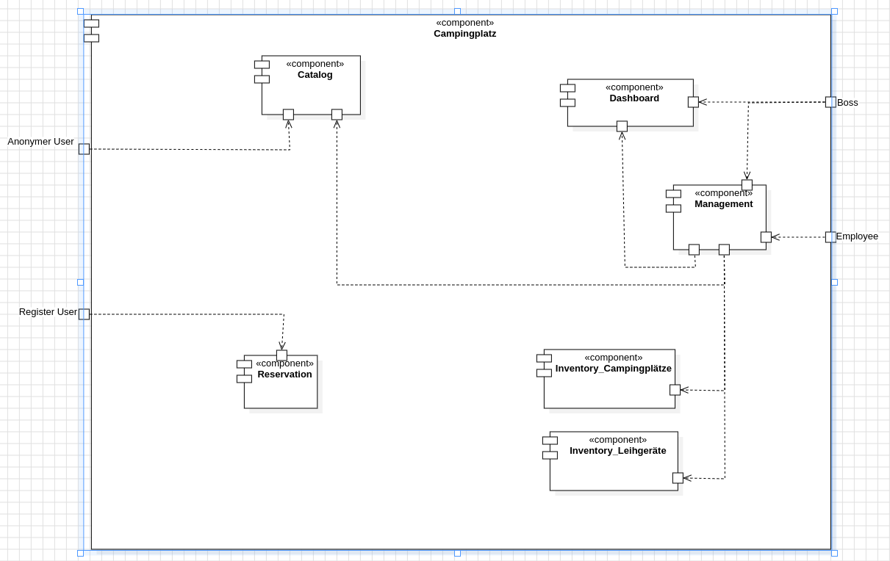

= Pflichtenheft
:project_name: Camping Platz
:company_name: Below-The-Sun
:toc: macro
:toc-title:
:toclevels: 1

== __{project_name}__

[options="header"]
[cols="1, 1, 1, 1, 4"]
|===
|Version | Status      | Bearbeitungsdatum   | Autoren(en) |  Vermerk
|0.1     | In Arbeit   | 10.10.2021          | Autor       | Initiale Version
|===

== Inhaltsverzeichnis
toc::[ ]

== Zusammenfassung
Eine kurze Beschreibung des Dokuments. Wenige Absätze.

== Aufgabenstellung und Zielsetzung
Der Betreiber des Campingplatzes Below-The-Sun hat die Gruppe sechs damit beauftragt, eine Software zu entwickeln. Der
Platz wächst stetig und ist gut besucht, doch es besteht ein starker Personalmangel. Der Betreiber erhofft sich
durch eine Software zum Self-Management der Camper eine Verringerung des Arbeitsaufwandes, sodass
Personal gezielter eingesetzt werden kann. +
Ein Beispiel ist die Reservierung: Bisher wird eine Person in
Vollzeit benötigt, um Reservierungen entgegenzunehmen und Stellplätze zu planen, diese Aufgabe könnte
die Software jedoch komplett selbst umsetzen.

Das wichtigste dabei ist natürlich die Verwaltung und Vergabe von Stellplätzen (_Plot_). +
**{company_name}** hat eine gewisse Anzahl von verschieden dimensionierten Stellplätzen.
An einigen ist direkt ein Parkplatz (_Attachment_) für Auto, Motorrad oder Campingwagen angegliedert.
Alle Kombinationen sind hier denkbar. +
Das Vorreservieren der Stellplätze soll möglich sein, die Reservierungen werden aber am Morgen nach dem geplanten Anreisetermin
gelöscht und der Platz steht anderen Campern wieder zur Verfügung. Jeder Kunde (_Costumer_) wird bei seiner Ankunft
von Mitarbeitern (_Employee_) offiziell eingecheckt und erhält den gewünschten Stellplatz automatisch zugewiesen. +
Sollte während der Reservierung oder des Check-in kein den Anforderungen des Kunden entsprechender
Stellplatz mehr vorhanden sein, so muss nach passenden Alternativen gesucht werden können. Eventuell kann der Camper
sein Auto beispielsweise auf einem anderen Parkplatz abstellen oder ist mit einem kleineren Platz zufrieden. +
Gruppen erhalten Gruppenrabatte auf die Plätze. +
Jeder Stellplatz kann durch Verschmutzung oder technische Defekte (_Issue_) ausfallen und bei der Reparatur Kosten
verursachen. Die Software sollte diese Tatsache beachten. +
Natürlich muss auch der Verbrauch von Strom und Wasser abgerechnet werden. Kunden bezahlen
Pauschalbeträge pro Tag, sie bekommen bei der Abreise eine Gesamtrechnung über Platzgebühren und
Nebenkosten.

Um seinen Kunden den Aufenthalt noch abwechslungsreicher zu gestalten, verleiht der
Betreiber von **{company_name}** auch Sportgeräte: Bälle, Tischtennisgarnituren, Volleyballnetze und
Federballsets. Dabei müssen die Camper eine Leihgebühr bezahlen und eine Kaution von 30 Euro hinterlegen,
die sie nach Rückgabe des unversehrten Gerätes wieder ausgehändigt bekommen. +
Über den Aufbau einer Fahrradvermietung wird ebenfalls nachgedacht. Kunden sollen ganz bequem einsehen können,
wann welche Sportgeräte ausleihbar sind und diese dann buchen.

Schließlich möchte der Besitzer (_Boss_) des Campingplatzes auch eine Übersichtsfunktion in die Software integriert haben,
worüber er jederzeit ein Dashboard mit den Einnahmen, der Auslastung, defekten Stellplätzen Geräten sowie
anderen nützlichen Informationen einsehen kann, um schnell zu reagieren. +
Mitarbeiter sollen Stellplätze, Sportgeräte und Preise variabel konfigurieren können.

Ein gesonderter Bereich von **{company_name}** ist in sogenannte Saisonstellplätze aufgeteilt. +
Hier bekommen
Dauercamper jedes Jahr von April bis Oktober denselben Platz zugewiesen, sofern sie sich rechtzeitig
anmelden. +
Die Stellplätze für Dauercamper haben entsprechende Anschlüsse mit Stromzählern und
Wasseruhren. Hier kann der Verbrauch direkt abgelesen werden, die Abrechnung erfolgt monatlich oder bei
der endgültigen Abreise.

== Produktnutzung
In welchem Kontext soll das System später genutzt werden? Welche Rahmenbedingungen gelten?
Zusätzlich kurze Einleitung für fachfremde Personen

== Interessensgruppen (Stakeholders)
Hier sind alle realen und juristischen Personen(-gruppen), die Einfluss auf die Anforderungen im Projekt haben, aufgelistet
Ausßerdem wird juder Gruppe ein "Priorität"-Wert zugeordnet, vom 1 bis 5
[options="header", cols="2, ^1, 4, 4"]
|===
|Name
|Priorität
|Beschreibung
|Ziele

|{company_name}
|5
|Der Klient
a|
- Automatisierung des Buchungsprozesses für Mitarbeiter
- Ermöglichen eines Reservierungsprozesses für Nutzer
- Übersicht über den Campingplatz über das Dashboard

|Mitarbeiter
|2
|Von unserem Klienten angestellte Mitarbeiter
a|
- Automatisierung des Buchungsprozesses für Mitarbeiter:
- Automatisches Management der Buchungen und Verfügbarkeit der Plätze

|Nutzer
|3
|Benutzer der Webseite, tatsächliche und potenzielle Kunden.
a|
- Ermöglichen eines Reservierungsprozesses für Nutzer:
- Übersicht über die buchbaren Plätze und Sportgeräte

|Developers
|3
|Die aktuellen entwickler der Webseite und die zukünftigen Maintainer
a|
- Einfach
- Wartbar
- Erweiterbar
|===

== Systemgrenze und Top-Level-Architektur

=== Kontextdiagramm
Das Kontextdiagramm zeigt das geplante Software-System in seiner Umgebung. Zur Umgebung gehören alle Nutzergruppen des Systems und Nachbarsysteme. Die Grafik kann auch informell gehalten sein. Überlegen Sie sich dann geeignete Symbole. Die Grafik kann beispielsweise mit Visio erstellt werden. Wenn nötig, erläutern Sie diese Grafik.

[[context_diagram]]
image::./projektbezogene_dateien/images/context.png[context diagram, 100%, 100%, pdfwidth=100%, title= "Context diagram of the {project_name} in UML", align=center]

=== Top-Level-Architektur
Dokumentieren Sie ihre Top-Level-Architektur mit Hilfe eines Komponentendiagramm.

[[TLA]]

== Anwendungsfälle

=== Akteure

Akteure sind die Benutzer der Campingplatz Webseite. +
Akteure, die weiter unten in der Tabelle sind, besitzen alle Rechte über ihnen.

[options="header"]
[[registered_user]]
[[actors]]
|===
|Name | Rechte
|Anonymer Nutzer +
(_User_)| Repräsentiert alle Personen die mit dem System interagieren
|Kunde +
(_Costumer_)| Repräsentiert alle Personen, die dem System gegenüber authentifiziert sind
|Mitarbeiter +
(_Employee_)| Repräsentiert alle Personen, die Änderungen in Datenbanken vornehmen können.
|Boss +
(_Boss_)| Eine Person die anderen Nutzer Rechte zuweist
|===

=== Überblick Anwendungsfalldiagramm
Anwendungsfall-Diagramm, das alle Anwendungsfälle und alle Akteure darstellt

=== Anwendungsfallbeschreibungen
Dieser Unterabschnitt beschreibt die Anwendungsfälle. Schwerpunkt ist es, die wichtigsten Anwendungsfälle des Systems aufzulisten.

[cols="1h, 3"]
[[AccountManagment]]
|===
|Name                       |**<<AccountManagment>>**
|Beschribung                |Ein benutzer soll sich in auf der Webseite einen Account erstellen können, dort einloggen können und sich auch ausloggen können
|Akteure                     |User
|Trigger                    |Nutzer drückt das entsprechende navigations Element
|Vorbedingungen           a|
_Registrieren_: User ist nicht in einem Account eingeloggt +
_Login_: User ist nicht in einem Account eingeloggt +
_Logout_: User ist in einem Account eingeloggt
|Schritte          a|
_Registrieren_:

1. Nutzer drückt "Registrieren" in der navigations Leiste
2. Nutzer füllt das Formular aus
3. Account erstellung im System

_Login_:

1. Nutzer drückt "Einloggen" in der navigations Leiste
2. Nutzer füllt das Formular aus

_Logout_:

1. Nutzer drückt "Ausloggen" in der navigations Leiste
2. Nutzer wird auf den Home Bildschirm umgeleitet
|===

[[PlatzKatalog]]
[cols="1h, 3"]
|===
|Name                       |**<<PlatzKatalog>>**
|Beschreibung                |Jeder Nutzer der Camingplatz Webseite soll in der Lage sein den vollen Katalog der verfügbaren Stellplätze zu sehen
|Akteure                     |User
|Trigger                    |Nutzer drückt das navigations Element, um zu der Katalog sicht zu navigieren
|Vorbedingungen            a|None
|Schritte                  a|
1. Nutzer drückt "Plätze Buchen" in der navigations Leiste
2. Nutzer bekommt alle Plätze in einer Liste angezeigt
|===

== Funktionale Anforderungen

=== Muss-Kriterien
Was das zu erstellende Programm auf alle Fälle leisten muss.

=== Kann-Kriterien
Anforderungen die das Programm leisten können soll, aber für den korrekten Betrieb entbehrlich sind.

== Nicht-Funktionale Anforderungen

=== Qualitätsziele

Dokumentieren Sie in einer Tabelle die Qualitätsziele, welche das System erreichen soll, sowie deren Priorität.

=== Konkrete Nicht-Funktionale Anforderungen

Beschreiben Sie Nicht-Funktionale Anforderungen, welche dazu dienen, die zuvor definierten Qualitätsziele zu erreichen.
Achten Sie darauf, dass deren Erfüllung (mindestens theoretisch) messbar sein muss.

== GUI Prototyp

In diesem Kapitel soll ein Entwurf der Navigationsmöglichkeiten und Dialoge des Systems erstellt werden.
Idealerweise entsteht auch ein grafischer Prototyp, welcher dem Kunden zeigt, wie sein System visuell umgesetzt werden soll.
Konkrete Absprachen - beispielsweise ob der grafische Prototyp oder die Dialoglandkarte höhere Priorität hat - sind mit dem Kunden zu treffen.

=== Überblick: Dialoglandkarte
Erstellen Sie ein Übersichtsdiagramm, das das Zusammenspiel Ihrer Masken zur Laufzeit darstellt. Also mit welchen Aktionen zwischen den Masken navigiert wird.
//Die nachfolgende Abbildung zeigt eine an die Pinnwand gezeichnete Dialoglandkarte. Ihre Karte sollte zusätzlich die Buttons/Funktionen darstellen, mit deren Hilfe Sie zwischen den Masken navigieren.

=== Dialogbeschreibung
Für jeden Dialog:

1. Kurze textuelle Dialogbeschreibung eingefügt: Was soll der jeweilige Dialog? Was kann man damit tun? Überblick?
2. Maskenentwürfe (Screenshot, Mockup)
3. Maskenelemente (Ein/Ausgabefelder, Aktionen wie Buttons, Listen, …)
4. Evtl. Maskendetails, spezielle Widgets

== Datenmodell

=== Überblick: Klassendiagramm
UML-Analyseklassendiagramm

=== Klassen und Enumerationen
Dieser Abschnitt stellt eine Vereinigung von Glossar und der Beschreibung von Klassen/Enumerationen dar. Jede Klasse und Enumeration wird in Form eines Glossars textuell beschrieben. Zusätzlich werden eventuellen Konsistenz- und Formatierungsregeln aufgeführt.

// See http://asciidoctor.org/docs/user-manual/#tables
[options="header"]
|===
|Klasse/Enumeration |Beschreibung |
|…                  |…            |
|===

== Akzeptanztestfälle
Mithilfe von Akzeptanztests wird geprüft, ob die Software die funktionalen Erwartungen und Anforderungen im Gebrauch erfüllt. Diese sollen und können aus den Anwendungsfallbeschreibungen und den UML-Sequenzdiagrammen abgeleitet werden. D.h., pro (komplexen) Anwendungsfall gibt es typischerweise mindestens ein Sequenzdiagramm (welches ein Szenarium beschreibt). Für jedes Szenarium sollte es einen Akzeptanztestfall geben. Listen Sie alle Akzeptanztestfälle in tabellarischer Form auf.
Jeder Testfall soll mit einer ID versehen werde, um später zwischen den Dokumenten (z.B. im Test-Plan) referenzieren zu können.

== Glossar
Sämtliche Begriffe, die innerhalb des Projektes verwendet werden und deren gemeinsames Verständnis aller beteiligten Stakeholder essentiell ist, sollten hier aufgeführt werden.
Insbesondere Begriffe der zu implementierenden Domäne wurden bereits beschrieben, jedoch gibt es meist mehr Begriffe, die einer Beschreibung bedürfen. +
Beispiel: Was bedeutet "Kunde"? Ein Nutzer des Systems? Der Kunde des Projektes (Auftraggeber)?

== Offene Punkte
Offene Punkte werden entweder direkt in der Spezifikation notiert. Wenn das Pflichtenheft zum finalen Review vorgelegt wird, sollte es keine offenen Punkte mehr geben.
