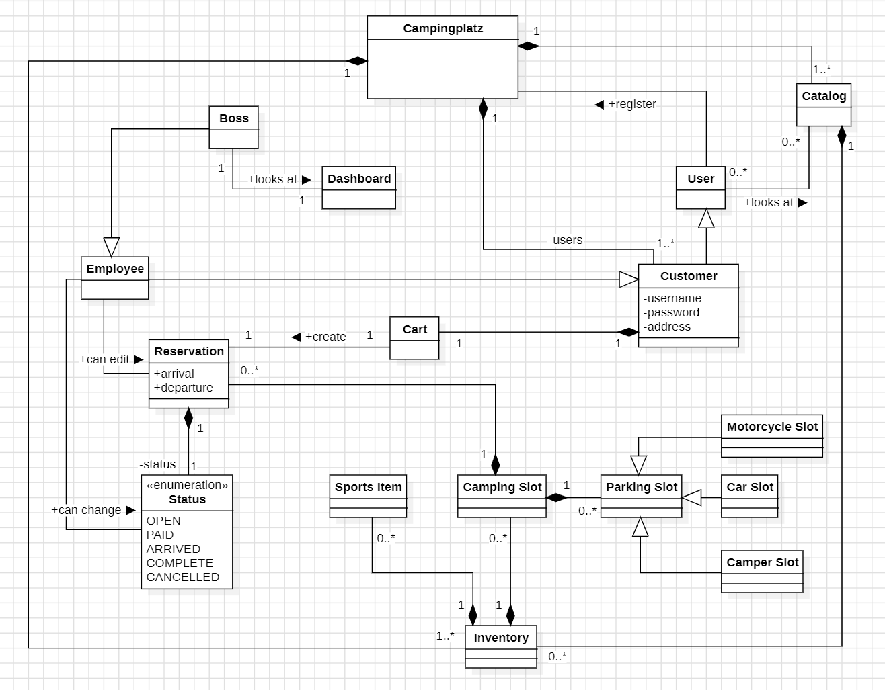

= Pflichtenheft
// Table of Contents macro related
:toc: macro
:toc-title:
:toclevels: 2

// Variablen für Bezeichnungen die mit der Firma zutun haben
:project_name: Camping Platz
:company_name: Below-The-Sun
:campsite: Campingplatz
:website: Campingplatz-Webseite
:system: System

// Variablen für Bezeichnungen der Navigationselemente der Webseite
:navigate_catalog: Platzreservierung
:navigate_sports_eqipment: Sportgerätverleih
:navigate_login: Einloggen
:navigate_logout: Ausloggen
:navigate_register: Anmelden
:navigate_dashboard: Dashboard

// Variablen für grundlegende Bezeichnungen
:base_user: Nutzer
:base_customer: Kunde
:base_employee: Mitarbeiter
:base_boss: Boss
:base_developers: Developers
:base_catalog: Katalog
:base_reserve: Reservierung
:base_plot: Platz
:base_plots: Plätze

// Links in den glossar. Es sind sie zu benutzen, wenn möglich
:glossar_user: <<{base_user}, {base_user}>>
:glossar_customer: <<{base_customer}, {base_customer}>>
:glossar_employee: <<{base_employee}, {base_employee}>>
:glossar_boss: <<{base_boss}, {base_boss}>>
:glossar_developers: <<{base_developers}, {base_developers}>>
:glossar_company_name: <<{company_name}, {company_name}>>
:glossar_website: <<{website}, {website}>>
:glossar_system: <<{system}, {system}>>
:glossar_catalog: <<{base_catalog}, {base_catalog}>>
:glossar_reserve: <<{base_reserve}, {base_reserve}>>
:glossar_plot: <<{base_plot}, {base_plot}>>
:glossar_plots: <<{base_plot}, {base_plots}>>

== __{project_name}__

[options="header"]
[cols="1, 1, 1, 1, 4"]
|===
|Version | Status      | Bearbeitungsdatum   | Autoren(en) |  Vermerk
|0.1     | In Arbeit   | 10.10.2021          | Autor       | Initiale Version
|===

== Inhaltsverzeichnis
toc::[ ]

== Zusammenfassung
Eine kurze Beschreibung des Dokuments. Wenige Absätze.

== Aufgabenstellung und Zielsetzung
Der Betreiber des Campingplatzes Below-The-Sun hat die Gruppe sechs damit beauftragt, eine Software zu entwickeln. Der
Platz wächst stetig und ist gut besucht, doch es besteht ein starker Personalmangel. Der Betreiber erhofft sich
durch eine Software zum Self-Management der Camper eine Verringerung des Arbeitsaufwandes, sodass
Personal gezielter eingesetzt werden kann. +
Ein Beispiel ist die Reservierung: Bisher wird eine Person in
Vollzeit benötigt, um Reservierungen entgegenzunehmen und Stellplätze zu planen, diese Aufgabe könnte
die Software jedoch komplett selbst umsetzen.

Das wichtigste dabei ist natürlich die Verwaltung und Vergabe von Stellplätzen (_Plot_). +
**{glossar_company_name}** hat eine gewisse Anzahl von verschieden dimensionierten Stellplätzen.
An einigen ist direkt ein Parkplatz (_Attachment_) für Auto, Motorrad oder Campingwagen angegliedert.
Alle Kombinationen sind hier denkbar. +
Das Vorreservieren der Stellplätze soll möglich sein, die Reservierungen werden aber am Morgen nach dem geplanten Anreisetermin
gelöscht und der Platz steht anderen Campern wieder zur Verfügung. Jeder Kunde (_Costumer_) wird bei seiner Ankunft
von Mitarbeitern (_Employee_) offiziell eingecheckt und erhält den gewünschten Stellplatz automatisch zugewiesen. +
Sollte während der Reservierung oder des Check-in kein den Anforderungen des Kunden entsprechender
Stellplatz mehr vorhanden sein, so muss nach passenden Alternativen gesucht werden können. Eventuell kann der Camper
sein Auto beispielsweise auf einem anderen Parkplatz abstellen oder ist mit einem kleineren Platz zufrieden. +
Gruppen erhalten Gruppenrabatte auf die Plätze. +
Jeder Stellplatz kann durch Verschmutzung oder technische Defekte (_Issue_) ausfallen und bei der Reparatur Kosten
verursachen. Die Software sollte diese Tatsache beachten. +
Natürlich muss auch der Verbrauch von Strom und Wasser abgerechnet werden. Kunden bezahlen
Pauschalbeträge pro Tag, sie bekommen bei der Abreise eine Gesamtrechnung über Platzgebühren und
Nebenkosten.

Um seinen Kunden den Aufenthalt noch abwechslungsreicher zu gestalten, verleiht der
Betreiber von **{glossar_company_name}** auch Sportgeräte: Bälle, Tischtennisgarnituren, Volleyballnetze und
Federballsets. Dabei müssen die Camper eine Leihgebühr bezahlen und eine Kaution von 30 Euro hinterlegen,
die sie nach Rückgabe des unversehrten Gerätes wieder ausgehändigt bekommen. +
Über den Aufbau einer Fahrradvermietung wird ebenfalls nachgedacht. Kunden sollen ganz bequem einsehen können,
wann welche Sportgeräte ausleihbar sind und diese dann buchen.

Schließlich möchte der Besitzer (_Boss_) des Campingplatzes auch eine Übersichtsfunktion in die Software integriert haben,
worüber er jederzeit ein Dashboard mit den Einnahmen, der Auslastung, defekten Stellplätzen Geräten sowie
anderen nützlichen Informationen einsehen kann, um schnell zu reagieren. +
Mitarbeiter sollen Stellplätze, Sportgeräte und Preise variabel konfigurieren können.

Ein gesonderter Bereich von **{glossar_company_name}** ist in sogenannte Saisonstellplätze aufgeteilt. +
Hier bekommen
Dauercamper jedes Jahr von April bis Oktober denselben Platz zugewiesen, sofern sie sich rechtzeitig
anmelden. +
Die Stellplätze für Dauercamper haben entsprechende Anschlüsse mit Stromzählern und
Wasseruhren. Hier kann der Verbrauch direkt abgelesen werden, die Abrechnung erfolgt monatlich oder bei
der endgültigen Abreise.

== Produktnutzung
In welchem Kontext soll das System später genutzt werden? Welche Rahmenbedingungen gelten?
Zusätzlich kurze Einleitung für fachfremde Personen

Das System wird als Webanwendung für die Planung und Buchung von Campingplätzen und für die Vermietung von Sportgeräten durch die Benutzer der Website (die potenziellen Kunden des Campingplatzes) genutzt. Es wird auch von den Mitarbeitern des Campings zur Verwaltung der Reservierungen und der Stellplätze verwendet.

Die Software sollte über einen Browser zugänglich sein (Google Chrome, Version 118.0.5993.89).

Sowohl von den Hauptbenutzern (Kunden und Mitarbeiter),als auch von dem Administrator (Betrieber des Campingplatzes Below-The-Sun) werden nur die grundlegendsten Kenntnisse im Umgang mit einer Website erwartet.

Der Administrator muss nicht mit HTML, Java und Springboot vertraut sein.

== Interessensgruppen (Stakeholders)
Hier sind alle realen und juristischen Personen(-gruppen), die Einfluss auf die Anforderungen im Projekt haben, aufgelistet
Ausßerdem wird juder Gruppe ein "Priorität"-Wert zugeordnet, vom 1 bis 5
[options="header", cols="2, ^1, 4, 4"]
|===
|Name
|Priorität
|Beschreibung
|Ziele

|{glossar_company_name}
|5
|Der Klient
a|
- Automatisierung des Buchungsprozesses für Mitarbeiter
- Ermöglichen eines {glossar_reserve}sprozesses für Nutzer
- Übersicht über den {campsite} über das Dashboard

|{glossar_employee}
|2
|Von unserem Klienten angestellte Mitarbeiter
a|
- Automatisierung des Buchungsprozesses für Mitarbeiter:
- Automatisches Management der Buchungen und Verfügbarkeit der {glossar_plots}

|{glossar_user}
|3
|Benutzer der Webseite, tatsächliche und potenzielle Kunden.
a|
- Ermöglichen eines {glossar_reserve}sprozesses für Nutzer:
- Übersicht über die buchbaren {glossar_plots} und Sportgeräte

|{glossar_developers}
|3
|Die aktuellen entwickler der {glossar_website} und die zukünftigen Maintainer
a|
- Einfach
- Wartbar
- Erweiterbar
|===

== Systemgrenze und Top-Level-Architektur

=== Kontextdiagramm
Das Kontextdiagramm zeigt das geplante Software-System in seiner Umgebung. Zur Umgebung gehören alle Nutzergruppen des Systems und Nachbarsysteme. Die Grafik kann auch informell gehalten sein. Überlegen Sie sich dann geeignete Symbole. Die Grafik kann beispielsweise mit Visio erstellt werden. Wenn nötig, erläutern Sie diese Grafik.

[[context_diagram]]
image::./projektbezogene_dateien/images/context.png[context diagram, 100%, 100%, pdfwidth=100%, title= "Context diagram of the {project_name} in UML", align=center]

=== Top-Level-Architektur
Dokumentieren Sie ihre Top-Level-Architektur mit Hilfe eines Komponentendiagramm.

[[TLA]]
image::./projektbezogene_dateien/images/tla.png[top-level architecture, 100%, 100%, pdfwidth=100%, title= "Top Level Architecture of the {project_name} in UML", align=center]

== Anwendungsfälle

=== Akteure

Akteure sind die Benutzer der Campingplatz Webseite. +
Akteure, die weiter unten in der Tabelle sind, besitzen alle Rechte über ihnen.

[options="header"]
[[registered_user]]
[[actors]]
|===
|Name | Rechte
|{glossar_user} +
(_User_)| Repräsentiert alle Personen die mit dem System interagieren
|{glossar_customer} +
(_Costumer_)| Repräsentiert alle Personen, die dem System gegenüber authentifiziert sind
|{glossar_employee} +
(_Employee_)| Repräsentiert alle Personen, die Änderungen in Datenbanken vornehmen können.
|{glossar_boss} +
(_Boss_)| Eine Person die anderen Nutzer Rechte zuweist
|===

=== Überblick Anwendungsfalldiagramm
Anwendungsfall-Diagramm, das alle Anwendungsfälle und alle Akteure darstellt
[[use_case]]

=== Anwendungsfallbeschreibungen
Dieser Unterabschnitt beschreibt die Anwendungsfälle. Schwerpunkt ist es, die wichtigsten Anwendungsfälle des Systems aufzulisten.

[[AccountManagment]]
[cols="1h, 3"]
|===
|Name                      |**<<AccountManagment>>**
|Beschribung               |Ein benutzer soll sich in auf der Webseite einen Account erstellen können, dort einloggen können und sich auch ausloggen können
|Akteure                   |{glossar_user}
|Trigger                   |{glossar_user} möchte seinen einloggen/registrieren, um einen {base_plot} zu <<{base_reserve}, reservieren>> oder möchte ausloggen
|Vorbedingungen           a|
_Registrieren_: {glossar_user} ist nicht in einem Account eingeloggt +
_Login_: {glossar_user} ist nicht in einem Account eingeloggt +
_Logout_: {glossar_user} ist in einem Account eingeloggt
|Schritte          a|
_Registrieren_:

1. {glossar_user} drückt "{navigate_register}" in der navigations Leiste
2. {glossar_user} füllt das Formular aus
3. Account erstellung im System

_Login_:

1. {glossar_user} drückt "{navigate_login}" in der navigations Leiste
2. {glossar_user} füllt das Formular aus

_Logout_:

1. {glossar_user} drückt "{navigate_logout}" in der navigations Leiste
2. {glossar_user} wird auf den Home Bildschirm umgeleitet

|Funktionale Anforderungen | <<F0010>> <<F0020>> <<F0021>>
|===

[[PlatzKatalog]]
[cols="1h, 3"]
|===
|Name                       |**<<PlatzKatalog>>**
|Done?                      |False
|Beschreibung               |Jeder {glossar_user} der {glossar_website} soll in der Lage sein den vollen {glossar_catalog} der verfügbaren Stell{glossar_plots} zu sehen
|Akteure                    |{glossar_user}
|Trigger                    |{glossar_user} möchte sich die Auswahl an {glossar_plots} ansehen
|Vorbedingungen            a|None
|Schritte                  a|
1. {glossar_user} drückt "{navigate_catalog}" in der navigations Leiste
2. {glossar_user} bekommt alle {glossar_plots} in einer Liste angezeigt
|Funktionale Anforderungen | <<F0100>> <<F0104>>
|===

[[PlatzReservieren]]
[cols="1h, 3"]
|===
|Name                       |**<<PlatzReservieren>>**
|Done?                      |False
|Beschreibung               |Jeder {glossar_customer} der {glossar_website} soll in der Lage sein den die im {glossar_catalog} angezeigten Stell{glossar_plots} zu <<{base_reserve}, reservieren>>
|Akteure                    |{glossar_customer}
|Trigger                    |{glossar_customer} möchte einen Platz <<{base_reserve}, reservieren>>
|Vorbedingungen            a|{glossar_customer} sieht den <<{base_plot}Katalog>>
|Schritte                  a|
1. {glossar_customer} drückt das entsprechende Element, um die {glossar_reserve} durchzuführen
|Funktionale Anforderungen | <<F0010>> <<F0104>> <<F0106>>
|===

[[SportgeräteKatalog]]
[cols="1h, 3"]
|===
|Name                       |**<<SportgeräteKatalog>>**
|Done?                      |False
|Beschreibung               |Jeder Nutzer der {glossar_website} soll in der Lage sein den vollen {glossar_catalog} der verfügbaren Sportgeräte zu sehen
|Akteure                    |{glossar_user}
|Trigger                    |Nutzer möchte sich die Auswahl an Sportgeräten ansehen
|Vorbedingungen            a|None
|Schritte                  a|
1. {glossar_user} drückt "{navigate_sports_eqipment}" in der navigations Leiste
2. {glossar_user} bekommt alle Sportgeräte in einer Liste angezeigt
|Funktionale Anforderungen | <<F0020>> <<F0114>>
|===

[[KundenEinchecken]]
[cols="1h, 3"]
|===
|Name                       |**<<KundenEinchecken>>**
|Done?                      |False
|Beschreibung               |Jeder {glossar_customer} wird bei seiner Ankunft von Mitarbeitern offiziell eingecheckt und erhält den gewünschten Stell{base_plot} zugewiesen.
|Akteure                    |{glossar_employee}
|Trigger                    |{glossar_customer} trifft physisch beim {campsite} ein
|Vorbedingungen            a|None
|Schritte                  a|
1. {glossar_employee} markiert die <<PlatzReservieren, Reservierung>> vom {glossar_customer} als wahrgenommen
|Extension                  | Wenn ein {glossar_customer} ohne Reservierung zum {campsite} kommt, müsste der Mitarbeiter für seine Verweilzeit eine {glossar_reserve} anlegen und sofort bestätigen. Stattdessen dem Mitarbeiter die option geben, das in einem Schritt zu machen
|Funktionale Anforderungen | <<F0010>> <<F0104>> <<F0107>>
|===

[[SportgeräteAusleihe]]
[cols="1h, 3"]
|===
|Name                       |**<<SportgeräteAusleihe>>**
|Done?                      |False
|Beschreibung               |Um seinen {glossar_customer}n den Aufenthalt noch abwechslungsreicher zu gestalten, verleiht der Betreiber von Below-The-Sun auch Sportgeräte
|Akteure                    |{glossar_employee}
|Trigger                    |{glossar_customer} leiht sich physisch ein Sportgerät aus
|Vorbedingungen            a|None
|Schritte                  a|
1. {glossar_employee} markiert das Sportgerät als ausgeliehen
|Funktionale Anforderungen | <<F0010>> <<F0115>>
|===

[[SportgeräteRückgabe]]
[cols="1h, 3"]
|===
|Name                       |**<<SportgeräteRückgabe>>**
|Done?                      |False
|Beschreibung               |Ausgeliehene Sportgeräte können auch zurückgegeben werden
|Akteure                    |{glossar_employee}
|Trigger                    |{glossar_customer} gibt physisch ein Sportgerät aus
|Vorbedingungen            a|Ein Sportgerät wurde <<SportgeräteAusleihe, Ausgeliehen>>
|Schritte                  a|
1. {glossar_employee} markiert das Sportgerät als verfügbar
|Funktionale Anforderungen | <<F0010>> <<F0116>>
|===

[[DatenAnpassen]]
[cols="1h, 3"]
|===
|Name                       |**<<DatenAnpassen>>**
|Done?                      |False
|Beschreibung               |{glossar_employee} sollen Stell{glossar_plots}, Sportgeräte und Preise variabel konfigurieren können.
|Akteure                    |{glossar_employee}
|Trigger                    |{glossar_employee} möchte etwas anpassen
|Vorbedingungen            a|None
|Schritte                  a|
1. {glossar_employee} navigiert zur entsprechenden Seite +
- <<PlatzKatalog>> für das Bearbeiten von Stellplätzen
- <<SportgeräteKatalog>> für das Bearbeiten von Sportgeräten
2. {glossar_employee} führt Änderung durch
- Ändert einen Wert
- Fügt einen artikel hinzu
- Entfernt einen Artikel
|Funktionale Anforderungen | <<F0010>> <<F0101>> <<F0102>> <<F0103>> <<F0111>> <<F0112>> <<F0113>>
|===

[[DashBoard]]
[cols="1h, 3"]
|===
|Name                       |**<<DashBoard>>**
|Done?                      |False
|Beschreibung               |der Besitzer des Campingplatzes möchte eine Übersichtsfunktion in die Software integriert haben
|Akteure                    |{glossar_boss}
|Trigger                    |{glossar_boss} möchte sich einen Überblick über seinen {campsite} verschaffen
|Vorbedingungen            a|None
|Schritte                  a|
1. {glossar_boss} drückt "{navigate_dashboard}" in der navigations Leiste
|Funktionale Anforderungen | <<F0010>> <<F0200>>
|===

== Funktionale Anforderungen

[options="header", cols="2h, 1, 3, 12"]
|===
|ID
|Version
|Name
|Description

|[[F0010]]<<F0010>>
|v0.1
|Authentifizierung
a|
Die {glossar_website} muss in allen {glossar_user} zugängliche Teile, authentifizierten {glossar_employee} zugängliche Teile, authentifizierten{glossar_employee} zugängliche Teile, und {glossar_boss} zugängliche Teile unterteilt werden können.
Wenn ein Benutzer im System vorhanden ist (<<AccountManagment, registrierter Benutzer>>), muss er in der Lage sein, sich zu authentifizieren (Login), indem er die
folgenden Informationen angibt:

* Benutzername
* Kennwort

|[[F0020]]<<F0020>>
|v0.1
|Registrierung
a|
Die {glossar_website} muss einem nicht authentifizierten Benutzer ({glossar_user}) die Möglichkeit bieten, sich zu registrieren, nachdem
das Navigationselement "Registrieren" aufzurufen.

Die folgenden Informationen müssen bereitgestellt werden:

* Benutzername
* E-Mail (eindeutig)
* Passwort

Die {glossar_website} validiert die angegebenen Daten (<<F0021>>).
Der Benutzer wird im System als Kunde registriert und kann sich nach erfolgreicher Validierung authentifizieren (<<F0010>>).

|[[F0021]]<<F0021>>
|v0.1
|Registrierung validieren
a|
Die {glossar_website} muss in der Lage sein, die angegebenen Daten eines nicht registrierten Benutzers zu validieren.

Die Einzigartigkeit der E-Mail muss gewährleistet sein, der {glossar_user} muss informiert werden, falls das nicht der Fall ist.

|[[F0100]]<<F0100>>
|v0.1
|{glossar_plots} Inventar
a|
Das {glossar_system} muss in der Lage sein, Daten über die {glossar_plots} in einem Inventar dauerhaft zu speichern.

|[[F0101]]<<F0101>>
|v0.1
|{glossar_plots} hinzufügen
a|
Das {glossar_system} muss in der Lage sein, dem Inventar {glossar_plots} hinzuzufügen.

|[[F0102]]<<F0102>>
|v0.1
|{glossar_plots} entfernen
a|
Das {glossar_system} muss in der Lage sein, dem Inventar {glossar_plots} zu entfernen.

|[[F0103]]<<F0103>>
|v0.1
|{glossar_plots} anpassen
a|
Das {glossar_system} muss in der Lage sein, Daten von {glossar_plots} vom Inventar anzupassen.

|[[F0104]]<<F0104>>
|v0.1
|{glossar_plots} {glossar_catalog}
a|
Das System muss in der Lage sein, {glossar_user}n einen {glossar_catalog} im Nur-Lese-Zugriff auf vorhandene {glossar_plots} zu ermöglichen.

|[[F0105]]<<F0105>>
|v0.1
|{glossar_plots} {glossar_catalog} filtern (optional)
a|
Das {glossar_system} muss einem {glossar_user} die Möglichkeit bieten, {glossar_plots} im {glossar_catalog} gefiltert nach einer gewählten Kategorie (größe, anliegender parkplatz)

|[[F0106]]<<F0106>>
|v0.1
|{glossar_plots} <<{base_reserve}, Reservieren>>
a|
Das System muss in der Lage sein, {glossar_plots} als reserviert für eine bestimmte Periode zu markieren

|[[F0107]]<<F0107>>
|v0.1
|{glossar_plots} {glossar_reserve} Wahrnehmen
a|
Das System muss in der Lage sein, {glossar_plots} als besetzt für eine bestimmte Periode zu markieren

|[[F0110]]<<F0110>>
|v0.1
|Sportgeräte Inventar
a|
Das {glossar_system} muss in der Lage sein, Daten über die Sportgeräte in einem Inventar dauerhaft zu speichern.

|[[F0111]]<<F0111>>
|v0.1
|Sportgeräte hinzufügen
a|
Das {glossar_system} muss in der Lage sein, dem Inventar Sportgeräte hinzuzufügen.

|[[F0112]]<<F0112>>
|v0.1
|Sportgeräte entfernen
a|
Das {glossar_system} muss in der Lage sein, dem Inventar Sportgeräte zu entfernen.

|[[F0113]]<<F0113>>
|v0.1
|Sportgeräte anpassen
a|
Das {glossar_system} muss in der Lage sein, Daten von Sportgeräte vom Inventar anzupassen.

|[[F0114]]<<F0114>>
|v0.1
|Sportgeräte {glossar_catalog}
a|
Das System muss in der Lage sein, {glossar_user}n einen {glossar_catalog} im Nur-Lese-Zugriff auf vorhandene Sportgeräte zu ermöglichen.

|[[F0115]]<<F0115>>
|v0.1
|Sportgeräte ausgeliehen
a|
Das {glossar_system} muss in der Lage sein, dem Inventar Sportgeräte als ausgeliehen zu markieren.

|[[F0116]]<<F0116>>
|v0.1
|Sportgeräte rückgeben
a|
Das {glossar_system} muss in der Lage sein, dem Inventar Sportgeräte als nicht mehr ausgeliehen zu markieren.

|[[F0200]]<<F0200>>
|v0.1
|Übersicht anzeigen
a|
Das {glossar_system} muss dem {glossar_boss} die Möglichkeit bieten nützlichen Informationen einzusehen, wie:
- Einnahmen, Ausgaben
- Auslastung
- Defekte Stell{glossar_plots}
- andere nützliche Informationen
|===

=== Muss-Kriterien
Was das zu erstellende Programm auf alle Fälle leisten muss.

=== Kann-Kriterien
Anforderungen die das Programm leisten können soll, aber für den korrekten Betrieb entbehrlich sind.

== Nicht-Funktionale Anforderungen

=== Qualitätsziele

Dokumentieren Sie in einer Tabelle die Qualitätsziele, welche das System erreichen soll, sowie deren Priorität.

1 = nicht wichtig ..
5 = sehr wichtig
[options="header", cols="3h, ^1, ^1, ^1, ^1, ^1"]
|===
|Qualitätsanforderungen           | 1 | 2 | 3 | 4 | 5
|Wartbarkeit          |   |   |   | x |
|Benutzerfreundlichkeit                |   |   |  |   |x
|Sicherheit                 |   |   |   | x |
|===

=== Konkrete Nicht-Funktionale Anforderungen

Beschreiben Sie Nicht-Funktionale Anforderungen, welche dazu dienen, die zuvor definierten Qualitätsziele zu erreichen.
Achten Sie darauf, dass deren Erfüllung (mindestens theoretisch) messbar sein muss.

[options="header", cols="2h, 1, 3, 12"]
|===
|ID
|Version
|Name
|Description

|[[NF0008]]<<NF0008>>
|v0.1
|Verfügbarkeit - Betriebszeit
a|
Das System sollte zumindest um die 90% der Zeit erreichbar/ funktional sein. In Saisonzeiten in denen viele Reservierungen getätigt werden bis zu 99%.

|[[NF0009]]<<NF0009>>
|v0.1
|Wartbarkeit - wenige Updates
a|
Das System sollte so konzipiert sein, das es Änderungen in der Organisation des Zeltplatzes ohne notwendige Updates übernehmen kann.

|[[NF0010]]<<NF0010>>
|v0.1
|Benutzerfreundlichkeit - intuitiv bedienbar
a|
Das System sollte mit seinem Design intuitiv und für alle Altersschichten leicht und verständlich bedienbar sein.

|[[NF0018]]<<NF0018>>
|v0.1
|Sicherheit - Passwortspeicherung
a|
Die Passwörter der Nutzer dürfen nur als Hash-Werte gespeichert werden, um Diebstahl zu verhindern.

|===

== GUI Prototyp
////
In diesem Kapitel soll ein Entwurf der Navigationsmöglichkeiten und Dialoge des Systems erstellt werden.
Idealerweise entsteht auch ein grafischer Prototyp, welcher dem Kunden zeigt, wie sein System visuell umgesetzt werden soll.
Konkrete Absprachen - beispielsweise ob der grafische Prototyp oder die Dialoglandkarte höhere Priorität hat - sind mit dem Kunden zu treffen.

////

[[home_image]]

[[home_reservation]]

[[home_reservation2]]

[[home_reservation-approved]]
image::./projektbezogene_dateien/images/gui-reservierungsbestätigung.png[Landing page, 100%, 100%, pdfwidth=100%, title= "Reservierungsbestätigung {project_name}", align=center]

[[home_logIn]]

[[home_Anmeldung]]

[[home_sportgeräteverleih]]
image::./projektbezogene_dateien/images/gui-sportgeräteverleih.png[Landing page, 100%, 100%, pdfwidth=100%, title= "Seite zum Ausleih von Sportgeräten vom {project_name}", align=center]

[[home_dashboard]]

////

=== Überblick: Dialoglandkarte
Erstellen Sie ein Übersichtsdiagramm, das das Zusammenspiel Ihrer Masken zur Laufzeit darstellt. Also mit welchen Aktionen zwischen den Masken navigiert wird.
//Die nachfolgende Abbildung zeigt eine an die Pinnwand gezeichnete Dialoglandkarte. Ihre Karte sollte zusätzlich die Buttons/Funktionen darstellen, mit deren Hilfe Sie zwischen den Masken navigieren.

=== Dialogbeschreibung
Für jeden Dialog:

1. Kurze textuelle Dialogbeschreibung eingefügt: Was soll der jeweilige Dialog? Was kann man damit tun? Überblick?
2. Maskenentwürfe (Screenshot, Mockup)
3. Maskenelemente (Ein/Ausgabefelder, Aktionen wie Buttons, Listen, …)
4. Evtl. Maskendetails, spezielle Widgets
////

== Datenmodell

=== Überblick: Klassendiagramm
UML-Analyseklassendiagramm

[[AnalyseKlassenDiagramm]]

=== Klassen und Enumerationen
Dieser Abschnitt stellt eine Vereinigung von Glossar und der Beschreibung von Klassen/Enumerationen dar. Jede Klasse und Enumeration wird in Form eines Glossars textuell beschrieben. Zusätzlich werden eventuellen Konsistenz- und Formatierungsregeln aufgeführt.

// See http://asciidoctor.org/docs/user-manual/#tables
[options="header"]
|===
|Klasse/Enumeration |Beschreibung |
|…                  |…            |
|===

== Akzeptanztestfälle
Mithilfe von Akzeptanztests wird geprüft, ob die Software die funktionalen Erwartungen und Anforderungen im Gebrauch erfüllt. Diese sollen und können aus den Anwendungsfallbeschreibungen und den UML-Sequenzdiagrammen abgeleitet werden. D.h., pro (komplexen) Anwendungsfall gibt es typischerweise mindestens ein Sequenzdiagramm (welches ein Szenarium beschreibt). Für jedes Szenarium sollte es einen Akzeptanztestfall geben. Listen Sie alle Akzeptanztestfälle in tabellarischer Form auf.
Jeder Testfall soll mit einer ID versehen werde, um später zwischen den Dokumenten (z.B. im Test-Plan) referenzieren zu können.

== Glossar

[options="header", cols="1h, 4"]
[[glossar]]
|===
|Term                                  |Description
|[[{base_user}]]{base_user}            |Eine beliebige Person, welche die {glossar_website} besucht
|[[{base_customer}]]{base_customer}    |Eine authentifizierte Person; eine Person welche in einem Account eingeloggt  ist
|[[{base_employee}]]{base_employee}    |Eine vom {campsite} angestellte Person; eine Person welche in einem Account eingeloggt ist, welcher als Mitarbeiter markiert ist
|[[{base_boss}]]{base_boss}            |Der Besitzer vom {campsite}; eine Person welche in einem Account eingeloggt ist, welcher als Boss markiert ist
|[[{company_name}]]{company_name}      |Unser Klient. Ein {campsite}
|[[{base_developers}]]{base_developers}|Die Entwickler der {glossar_website}. Aktuell sind wir, die Gruppe 6, das. In der Zukunft könnten das andere Entwicklerteams sein
|[[{website}]]{website}                |Das Produkt welchen wir erstellen, mit Fokus auf den frontend Teil
|[[{system}]]{system}                  |Das Produkt welchen wir erstellen, mit Fokus auf den backend Teil

|[[{base_plot}]]{base_plot}            |Ein Stellplatz, das Hauptprodukt des {glossar_company_name}. Auf ihm können die {glossar_customer} Zelt aufschlagen. Das Self-Management der {glossar_customer} für eine Verringerung des Arbeitsaufwandes des Personales ist die Hauptaufgabe der {glossar_website}
|[[{base_catalog}]]{base_catalog}      |Eine ein oder zwei dimensionale Liste an Karten, welche einzelne Katalog Elemenete representieren
|[[{base_reserve}]]{base_reserve}      |Markierung eines {base_plot}es auf einem bestimmten Zeitintervall. Andere {glossar_customer}n können dem selben {base_plot} in diesem Intervall nicht für sich reservieren.

|===
== Offene Punkte
Offene Punkte werden entweder direkt in der Spezifikation notiert. Wenn das Pflichtenheft zum finalen Review vorgelegt wird, sollte es keine offenen Punkte mehr geben.
